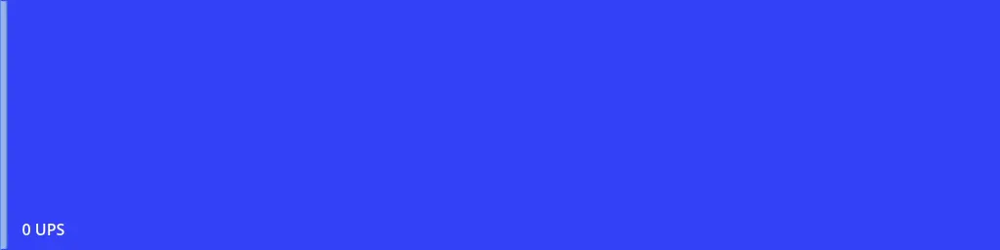
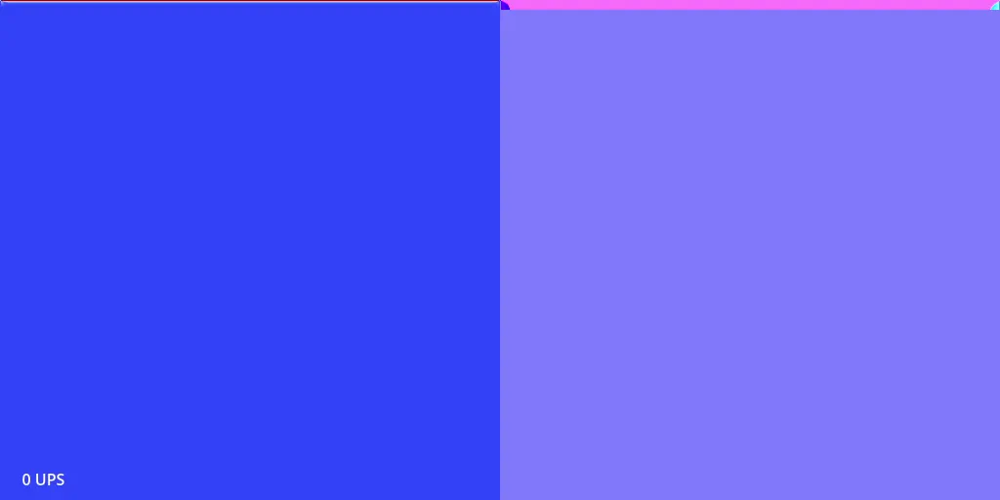
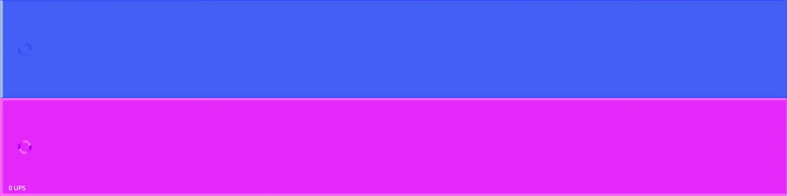

# Lattice Boltzmann Method fluid simulation in Godot

A real time 2D fluid simulation running on a compute shader through Godot's RenderingServer API.

  

## Examples

All of these examples were run on my Ryzen 5800X3D and RX 6800xt. The UPS is simulation "updates per second" since the frame is only updated once every 10 updates.

**Driven Cavity**

This is a 512x512 simple driven cavity example. The fluid along the north wall is driven to the right at a constant velocity. Think of an empty box being driven down a highway.

The top view shows velocity, where red is fast moving fluid, while blue is slow moving fluid.

The second view shows the direction of flow using standard normal map colors. This makes it easy to see the shape of the vortex in the center, while the slight turbulence at the bottom would otherwise be invisible.

  

**Wind Tunnel**

This 2048x256 example is a simple cylinder in a wind tunnel. At the start of the simulation a shockwave is visible moving from left to right. The fluid is moving fast enough to create vortices behind the cylinder.

  

**Corridor**

This is a 2048x256 sim showing the fluid being forced through a narrow corridor. Some interesting flow pockets are visible in the normal map.

  

## About

I originally started this project with the intent of exploring the Lattice Boltzmann Method as a possible game mechanic in a sandbox simulation game. Unfortunately the simulation is pretty unstable and easy to break, so it's not very useful for a game in it's current state. The code in this repo is still pretty rough, but I find the examples to be beautiful enough to be worth sharing. I hope you find it useful.

## Running the code

This repo can be opened as a Godot project, it was developed using v4.6.1-stable.

If you don't have Godot installed, you can also run it via the [Taskfile](https://taskfile.dev/) with `task run` which should work on Mac, Windows, and Linux

